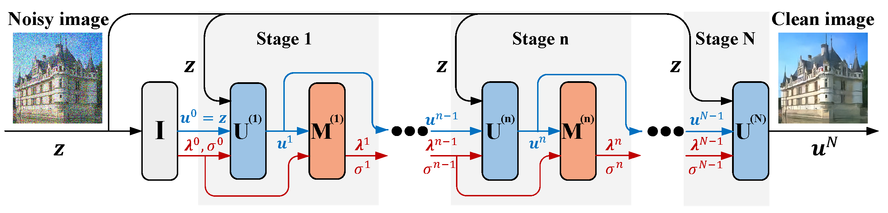
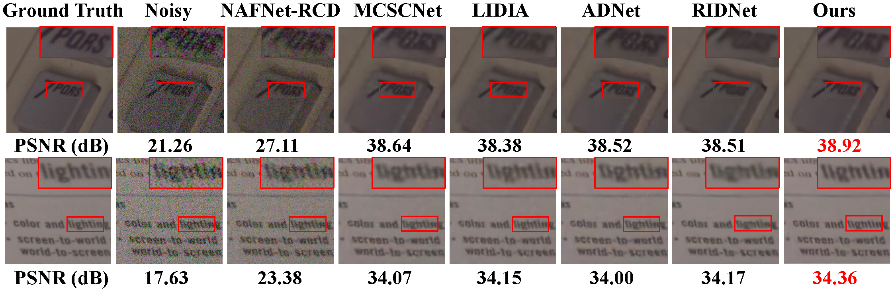
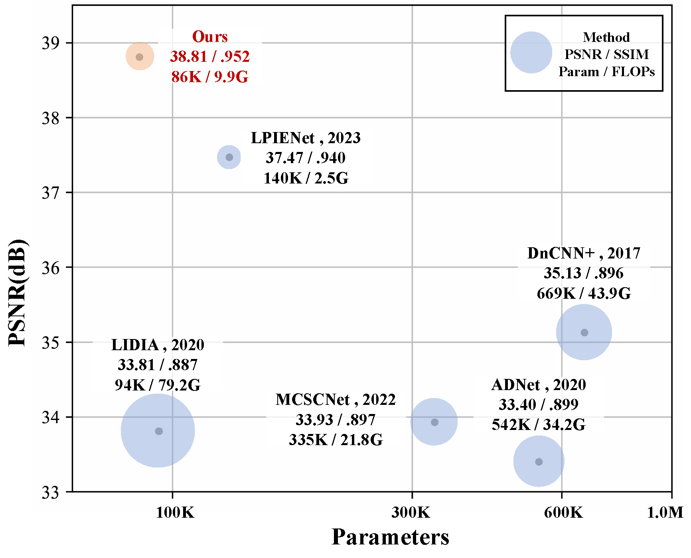

## SN-NET: Semismooth Newton Driven Lightweight Network for Real-world Image Denoising

The official pytorch implementation of the paper:

**[SN-NET: Semismooth Newton Driven Lightweight Network for Real-world Image Denoising (ICIP 2024 Oral)](https://ieeexplore.ieee.org/document/10647419)**

#### Chenxiao Zhang, Xin Deng, Hongpeng Sun, Jingyi Xu, Mai Xu


>Semismooth Newton is a powerful tool to tackle the regularization problems in image restoration. 
>Compared to other optimization methods such as alternating direction method of multipliers (ADMM), the semismooth Newton method exhibits faster convergence and greater efficiency, since the non-linear and coupling system is solved simultaneously. 
>However, its performance relies heavily on the handcrafted parameters and efficient solvers for calculating Newton steps. To tackle this issue, we first develop an improved semismooth Newton method, in which we turn the original nonlinear system solving problem into a network-friendly convex optimization problem. 
>After that, we unfold it into a novel network namely SN-Net. We apply SN-Net on the most fundamental image denoising task, which shows great advantages in the following two aspects. 
>(1) The network is quite lightweight, i.e., the number of network parameters is only 86 KB. 
>(2) The network structure exhibits strong interpretability.

### Network Structure



### Installation

```python
python 3.11.8
pytorch 2.2.1
cuda 11.8
```

```
git clone https://github.com/pandazcx/SN-Net.git
cd SN-Net
pip install -r requirements.txt
```

### Dataset
[Download training and test datasets](https://abdokamel.github.io/sidd/)


### Inference
Replace datasets.test.path in config.yml with your dataset path.
```
python test.py
```

### Train
Replace datasets.train.path in config.yml with your dataset path.
```
python train.py
```

### Denoising Performance


### Network Efficiency Comparison



### Citations
If SN-Net helps your research or work, please consider citing SN-Net.

```
@inproceedings{zhang2024sn,
  title={SN-NET: Semismooth Newton Driven Lightweight Network for Real-World Image Denoising},
  author={Zhang, Chenxiao and Deng, Xin and Sun, Hongpeng and Xu, Jingyi and Xu, Mai},
  booktitle={2024 IEEE International Conference on Image Processing (ICIP)},
  pages={1424--1430},
  year={2024},
  organization={IEEE}
}
```
### Contact

If you have any questions, please contact sy2339221@buaa.edu.cn


